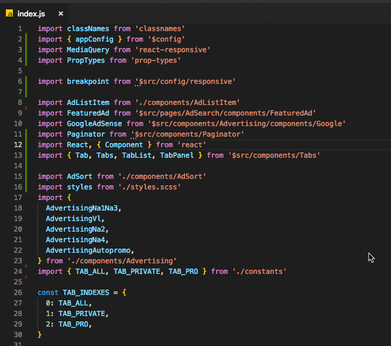

# import-sort-style-lbc

A style for [import-sort](https://github.com/renke/import-sort) that is focused
on path types.

Inspired from : [import-sort-style-module](https://github.com/renke/import-sort/tree/master/packages/import-sort-style-module)

(It'll **not** reorder a module if it has side effects)

# Demo :

Auto Sorting on save



# Details :

Sorting with this particular order :

```js
// Modules from the Node.js "standard" library sorted by name then Third-party modules sorted by name
import { readFile, writeFile } from "fs";
import * as path from "path";
import aa from "aa";
import bb from "bb";
import cc from "cc";

// Modules with an Absolute path sorted by name
import aaa from "$src/aaa";
import bbb from "$src/bbb";

// Modules with a relative path sorted by "depth" and then by name. Styles files will always be at the end.
import aaa from "../../aaa";
import bbb from "../../bbb";
import aaaaa from "./aaaaa";
import styles from "./styles.scss";
```

To enable the plugin add this to your package.json :

```
"importSort": {
  ".js": {
    "parser": "babylon",
    "style": "lbc"
  }
}
```

And install it with `npm install --save-dev import-sort-cli import-sort-parser-babylon import-sort-style-lbc`

You can find plugins for VSCode, Atom, Vim, JetBrains IDE and a CLI [here](https://github.com/renke/import-sort)
